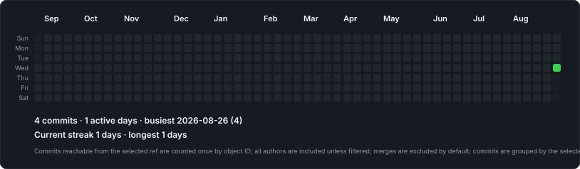

# Git Almanac

Inspect one local Git repository's calendars, authors, contributors, and reports without a network request or forge account.



## Try locally

Install dependencies once and run the checkout directly:

```bash
bun install
./bin/git-almanac calendar
```

The repository argument is optional. Git Almanac discovers the repository containing the current directory, including from a nested directory.

```bash
git almanac calendar /path/to/repository --path "packages/service with spaces"
git almanac authors /path/to/repository
git almanac contributors /path/to/repository --since 2026-01-01
```

## Output

Standalone commands write to standard output unless `--output` is supplied. HTML, SVG, and JSON extensions infer the format; explicit `--format` always wins.

```bash
git almanac calendar --no-color
git almanac calendar --output activity.svg
git almanac calendar --format html --theme dark > activity.html
git almanac contributors --format json --output contributors.json
```

Use `--output-dir` when you deliberately want one combined calendar and one file for every exact author identity:

```bash
git almanac calendar --format svg --output-dir ./calendar-set
```

## Local report

Generate the complete linked static report under `<repository-root>/reports/git-almanac/`:

```bash
git almanac report
open reports/git-almanac/index.html
```

Refresh one compatible section with `report calendar`, `report authors`, or `report contributors`. The manifest protects foreign directories and prevents partial output from combining different repository, ref, filter, date, timezone, identity, metric, or theme contracts.

Git Almanac warns when its report is not ignored. Add the narrowest safe rule, or initialise both configuration and ignore behavior:

```bash
git almanac ignore
git almanac init
```

## Configuration

`.git-almanac.toml` is optional and safe to commit. Built-in defaults apply first, repository configuration second, and CLI arguments last.

```bash
git almanac config init
git almanac config show
git almanac config check
```

The initial schema supports `ref`, `since`, `until`, `date`, `include_merges`, `metric`, `theme`, `author`, and `paths`. `commits` is the only current metric.

## Counting contract

By default Git Almanac:

- discovers the repository containing the current directory;
- uses commits reachable from `HEAD`;
- preserves each exact raw Git `Name <email>` author identity;
- includes all authors and excludes merge commits;
- groups commits by author date in the local timezone;
- counts each commit object once;
- covers 365 local calendar dates ending today; and
- reads history with one argument-safe `git log` traversal.

`--author`, `--path`, `--ref`, `--since`, `--until`, `--date`, and `--include-merges` make deviations explicit. Contributor percentages describe the selected commit history; they are not productivity scores.

The durable behavior contract lives in the [Git Almanac Specification](docs/specs/git-almanac.md), with product decisions in [Decision Records](docs/decisions/README.md).

## Install

Link the checkout executable and manual without publishing:

```bash
./install.sh --link
git almanac calendar
```

After the first immutable release:

```bash
curl -fsSL https://raw.githubusercontent.com/knowledgeislands/tools-git-almanac/main/install.sh | bash
brew tap knowledgeislands/tap
brew install git-almanac
```

The release installer verifies the published SHA-256 manifest before replacing an installed executable. Homebrew becomes available only after the tap independently accepts the prepared formula handoff for an immutable release.

[Guides](docs/guides/README.md) cover everyday use, local development, and release preparation.

## Why Git Almanac

The name describes a local collection of Git calendars, identities, statistics, and reports. The `git-almanac` executable is naturally available as the `git almanac` extension command.

## License

[MIT](LICENSE) © 2026 Kris Brown.
